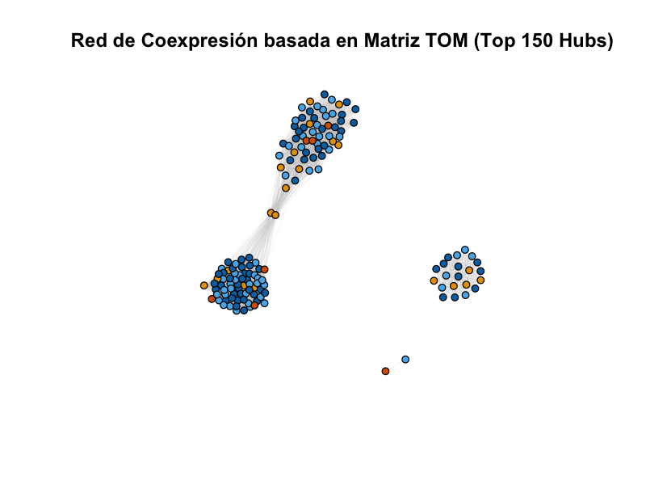

# Introducción

El cáncer de mama es el más común, es la segunda causa principal de muerte relacionada con el cáncer entre las mujeres de todo el mundo (Tian et al., 2020).
De las pacientes en fase temprana, entre el 20% y el 30% de los casos acaban desarrollándose hacia cáncer de mama avanzado (ABC).
Aunque actualmente es difícil curar el ABC, podemos aliviar los síntomas clínicos de los pacientes, mejorar su calidad de vida y prolongar aún más su tiempo de supervivencia aplicando nuevos fármacos terapéuticos y optimizando los modelos de tratamiento para lograr el propósito de supervivencia a largo plazo con tumores (Breast Cancer Expert Committee of the National Quality Control Center for Cancer et al., 2025).

Desde este punto de vista es indispensable expandir nuestro conocimiento respecto al proceso de carcinogénesis en tejido mamario, buscando comprender todos los aspectos y mecanismos moleculares involucrados en su desarrollo.
Esto nos proporciona una nueva perspectiva sobre la enfermedad y revelará nuevas dianas para desarrollar dichas estrategias, fármacos y tratamientos.
Como sabemos el cáncer es un proceso patológico caracterizado por células que se multiplican ilimitadamente, pierden su capacidad para entrar en apoptosis, desplazan a las células normales y forman masas de tejido llamadas tumores o neoplasias, causando alteraciones severas en el área del cuerpo donde se desarrolla; además, a la largo plazo, tienen la capacidad de diseminarse e invadir otras partes del organismo mediante metástasis (American Cancer Society, s. f.; National Cancer Institute, s. f.)

Es por esto que en el presente trabajo se realizará una red de co expresión a partir de muestras de pacientes con cáncer de mama, buscando correlaciones entre sus perfiles de expresión génica y determinando cuáles de ellos comparten funciones celulares similares.
Dado que el cáncer es una enfermedad altamente heterogénea, este enfoque nos permite identificar aquellos genes que participan en el proceso de carcinogénesis con mayor relevancia y conectividad entre las muestras analizadas ofreciendo una visión global.

# Objetivo

Realizar una red de co-expresión de genes asociados a cáncer de mama utilizando un enfoque de biología de sistemas, con el fin de identificar módulos funcionales y genes altamente conectados (hubs) que operan como reguladores potenciales en la enfermedad

# Metodología

**1.Obtención y filtrado de datos.** Se tomó como base la matriz de expresión génica de cáncer de mama correspondiente al estudio: “Identification of Important Modules and Biomarkers in Breast Cancer Based on WGCNA” (GSE25066).
Se eliminaron los metadatos clínicos y se conservaron únicamente los valores numéricos de expresión.

**2.Selección por varianza.** Con el fin de enfocarse en los genes con mayor relevancia biológica, se calculó la varianza fila por fila en la matriz.
Se ordenaron los datos de mayor a menor variabilidad y se seleccionaron los 5,000 más variables.
Posteriormente, la matriz se traspuso para situar las muestras en las filas y los genes en las columnas.

**3.Análisis de umbral de topología.** Mediante la función pickSoftThreshold() se probaron potencias exponenciales en un rango de 1 a 20 bajo un modelo de red no dirigida.
Se evaluó el índice de ajuste del modelo de topología free-scale (R\^2) y la conectividad media para determinar el power óptimo

**4.Construcción matriz de adyacencia y TOM.** Se calculó la matriz de adyacencia elevando las correlaciones de pearson a la potencia 4.
Para mitigar el ruido biológico y los falsos positivos.
La matriz de adyacencia se transformó en una matriz de solapamiento topológico, la cual mide la similitud entre genes basándose en la cantidad de vecinos compartidos.

**5.Modelado y detección de comunidades en grafos.** Se removió la auto-correlación en la diagonal y se aplicó un filtro estricto de peso mínimo (\> 0.05) para limpiar el ruido de fondo, la matriz se transformó en un objeto de red ponderado no dirigido.
Se empleó el algoritmo de Louvain (cluster_louvain) para agrupar los genes coexpresados en módulos o comunidades.

**6.Aislamiento y visualización de Hubs.** Se calculó el degree de cada nodo de la red completa.
Se extrajeron los 150 genes con mayor número de conexiones y se graficó su sub-red empleando el algoritmo de distribución de fuerzas de Fruchterman-Reingold.

# Resultados

{width="333"}

{width="333"}

{width="333"}

# Discusión

Para la construcción de nuestra red de co expresión se consideraron los 20 powers disponibles y mediante el análisis de 2 gráficas: Scale Free Topology y Mean Conectivity se consideró que el power que permitía la mejor interpretación era el power 4, dados los parámetros que se mencionaron en el gráfico 1 y el gráfico 2. 

La estructura de la red nos habla de que existen 3 clusters principales que ofrecen una perspectiva fascinante sobre la regulación transcripcional en el cáncer de mama, dentro de dos de estos si existe una coexpresión observada, mientras que existe otro cluster aislado que no se observa una coexpresión, esto nos puede hablar de expresión tardía y expresión temprana de genes, en donde los clusters que si presentan dicha coexpresión se expresan en diferentes momentos que los genes presentes en el cluster que no presenta coexpresión, sugiriendo que opera de manera completamente autónoma e independiente de los eventos transcripcionales del cluster principal.

Los dos clusters interconectados representan procesos biológicos masivos y complejos (como la progresión del ciclo celular y la remodelación de la matriz extracelular). Que ambos bloques dependan de un puente de solo dos genes (los nodos amarillos centrales) clasifica a estos últimos como genes conectores críticos. En la dinámica tumoral, estos dos genes actúan como un único puente de paso de información; si estos reguladores potenciales se alteran, toda la comunicación coordinada entre los dos procesos celulares colapsa. Esto los convierte en candidatos ideales para terapias dirigidas, ya que atacar el "cuello de botella" es estratégicamente más efectivo que atacar genes individuales en la periferia.

# Referencias 

-Tian, Z., He, W., Tang, J., Liao, X., Yang, Q., Wu, Y., y Wu, G.
(2020).
Identification of important modules and biomarkers in breast cancer based on WGCNA.
OncoTargets and Therapy, 13, 6805–6817.
<https://doi.org/10.2147/OTT.S258439>

-Breast Cancer Expert Committee of the National Quality Control Center for Cancer, Breast Cancer Expert Committee of the China Anti‐Cancer Association, & Cancer Drug Clinical Research Committee of the China Anti‐Cancer Association.
(2025).
Guidelines for the diagnosis and treatment of advanced breast cancer in China (2024 edition).
Cancer Innovation, 4(6), e70032.
<https://doi.org/10.1002/cai2.70032>

-American Cancer Society.
(s. f. [a]).
¿Qué es el cáncer?
Recuperado de <https://www.cancer.org/es/> cancer/aspectos-basicos-sobre-el-cancer/que-es-el-cancer.html

-National Cancer Institute.
(s. f.).
What is cancer?
Recuperado de <https://www.cancer.gov/> about-cancer/understanding/what-is-cancer
